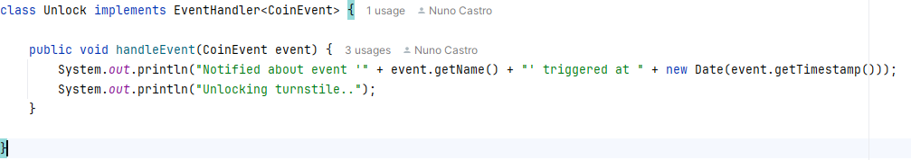

# RAMDE: Tarefa 1 - Relatório

## Introdução

### Máquina de Estados
Uma máquina de estados, também conhecida por máquina de estados finitos, é um modelo matemático usado para representar sistemas que normalmente têm um número finito de estados diferentes. Ou seja, como o próprio nome indica baseia-se em direcionar o funcionamento de um software em um número finito de estados, sendo cada um desses estados uma situação importante do sistema.
As máquinas de estados podem ser divididas em duas categorias:

- Máquinas de Mealy;
- Máquinas de Moore;

### Máquinas de Moore;
É uma máquina de estado finito do qual a saída depende exclusivamente do estado atual. As máquinas de Moore são bastante utilizadas em ramos que requerem automação sequencial.

### Máquinas de Mealy:
É uma máquina de estado finito do qual a saída depende do estado atual e da entrada de dados, ou seja, a saída está diretamente ligada às transições realizadas. As máquinas de Mealy são muito utilizadas em projetos de diálogos entre usuário e computador.

### Principais diferenças entres Mealy e Moore
A principal diferença é que enquanto em Mealy a saída depende do estado atual e da entrada, em Moore apenas depende do estado atual. Devido a esta diferença, acontece que nas máquinas de Moore é necessário esperar pela próxima transição de relógio para alterar o valor da saída em resposta a uma alteração na entrada. Enquanto que em Mealy as saídas mudam imediatamente em resposta a uma alteração na entrada.

## Problema

O problema apresentado neste projeto consistia em duas fases.

- Inicialmente, em melhorar um programa relacionado a máquinas de estados, incluindo a verificação e a implementação, se necessária, de melhorias para suportar máquinas de Moore e Mealy.
- E a criação de um modelo de um interruptor de luz utilizando ambos os formatos.

## Requerimentos da tarefa

- Instalar e configurar as ferramentas necessárias, como Java, Eclipse, Maven e Git.
- Análise e Melhoria do Projeto
- Validar suporte a Máquinas de Estados Moore e Mealy
- Implementação de Exemplo para Light Switch
- Validar e melhorar Testes de Unidade

## Design da solução

O projeto tem adesão aos princípios SOLID:

1. **Single-Responsability Principle**, com classes como `AbstractEvent`, `Event`, `EventHandler`, `FiniteStateMachine` e outras, cada uma com responsabilidades claramente definidas.
1. **Open-Closed Principle** é seguido pelo `FiniteStateMachineBuilder`, que permite a adição de novos estados e transições sem modificar o código existente, enquanto a interface `EventHandler` permite eventos personalizados. 
1. **Liskov Substitution Principle** é respeitado, uma vez que subclasses de `AbstractEvent` e classes que implementam `EventHandler` podem ser utilizadas alternativamente.
1. **Interface Segregation Principle** é evidenciado pela divisão da interface `FiniteStateMachine` em componentes menores, facilitando implementações mais específicas.
1. **Dependency Inversion Principle* é aplicado, pois o `FiniteStateMachineBuilder` depende de abstrações como `State`, `Transition` e `EventHandler`, promovendo um baixo acoplamento com implementações concretas.

## Implementação da solução

O projeto suporta Máquinas de Estados de Mealy, mas não suporta Máquinas de Estados de Moore.

### Adicionar suporte para o Moore

Para adicionar suporte ao Moore na máquina de estados, realizamos algumas alterações na estrutura do código.

1. Primeiro, acrescentamos um atributo `Output` à classe `State`, que define a saída associada a cada estado. Isso permite que cada estado tenha um valor de saída específico, facilitando a implementação do modelo de Moore.

2. Por fim, alteramos a classe `FiniteStateMachineImpl` para verificar se a transição não possui um `event handler`. Caso não haja, o programa exibe automaticamente a saída do estado atual.

### Implementação de Turnstile utilizado Maquina de Estados de Mealy

Para este problema, já está implementado o Mealy, então vamos detalhar o que está feito.

No diagrama abaixo, temos dois estados (`Locked`, `Unlocked`), dois eventos (`Coin`, `Push`), e quatro transições.

1. Primeiro, criamos as classes de evento para `CoinEvent` e `PushEvent`:

2. De seguida, precisamos de `Event Handlers` que definem as ações associadas a cada transição. Então, implementamos as classes `Lock` e `Unlock` para manipular essas ações:

3. Na classe `Main`, definimos os dois estados (`Locked` e `Unlocked`):

4. Adinamos as quatro transições (de acordo com o diagrama), e associamos os eventos e event handlers:

5. Registro das Transições e Estado Inicial:

6. Por fim, para testar a máquina de estados Mealy no terminal, adicionamos um código que permite simular as transições por linha de comando:

Resultado da Execução:

### Implementação de Turnstile utilizado Maquina de Estados de Moore

Para a versão de Moore, o processo é semelhante ao do Mealy, com algumas diferenças.

1. Os eventos ainda são necessários para a transição de estados, mas os event handlers (`Lock`, `Unlock`) não são necessários.

   

2. Como estamos no modelo de Moore, cada estado define sua saída. Na configuração dos estados, agora especificamos o `Output` diretamente:

3. Nas transições, paramos de associar event handlers, pois a saída é controlada pelos próprios estados.

Resultado da Execução:

### Implementação de um interruptor de luz utilizando Maquinas de Estados de Moore

Para a realização da implementação de Moore seguiu-se as seguintes etapas: 

1. Defenir todos os estados

Foram criados quatro objetos `State` para representar os diferentes niveis de brilho: `brightnessLow`, `brightnessMedium`, `brightnessHigh` e `brightnessOff `.

2. Defenir todas as transições

Na imagem seguinte, apresenta-se uma das transições realizadas, a `TurnOnLight`. Esta transição leva a Maquina de Estados do estado `brightnessOff ` para `brightnessLow` quando ocorre o evento `LightOnEvent`.   

 

3. Construção da Maquina De Estados

Nesta parte do codigo, construimos a instancia `lightFSM` , e define-se o estado inicial `brightnessOff`. Cada transição defenida anteriormente é registada, para a Maquina de Estados saber como responder a cada evento.                                                
   
   

Após a realização de todas estas etapas podemos vizualizar o seguinte.

### Implementação de um interruptor de luz utilizando Maquinas de Estados de Mealy

Para a realização da implementação de Mealy executou-se as seguintes etapas:

1. Defenir todos os estados

Foram criados quatro objetos `State` para representar os diferentes niveis de brilho: `brightnessLow`, `brightnessMedium`, `brightnessHigh` e `brightnessOff `.

2. Defenir todas as classes implementando `Event Handlers`  

Cada class printa o evento e altera o nivel de brilho

 

3. Defenir todas as transições

Seguidamente, apresenta-se uma das transações realizadas, neste caso altera-se o estado de `brightnessOff` para `brightnessLow` quando ocorre o evento `brightnessLow`.

   

4. Construção da Maquina De Estados

Nesta parte do codigo, construimos a instancia `lightFSM` , e define-se o estado inicial `brightnessOff`. Cada transição defenida anteriormente é registada, para a Maquina de Estados saber como responder a cada evento.

Após a realização de todas estas etapas podemos vizualizar o seguinte.

 

### Testes

Em termos de testes, existem 21 testes que cobrem grande parte dos casos, mas podemos melhorar a cobertura ao adicionar os seguintes testes:

1. **FiniteStateMachineImplTest**

   - Testar transições múltiplas com eventos diferentes.   
   - Testar eventos não registrados.

2. **TransitionDefinitionValidatorTest**

   - Testes para estados ou eventos nulos.

3. **TransitionImplTest**

   - Testar transições com o mesmo estado de origem e evento.

4. **UtilsTest**

   - Testar estados vazios na FSM.

## Solução alternativa

Uma solução alternativa seria adotar o Test-Driven Development (TDD). Essa abordagem permite que criemos os testes antes de implementar o código, garantindo que todas as regras de Mealy e Moore sejam implementadas de forma mais eficiente e eficaz. Com o TDD, podemos validar cada parte da funcionalidade à medida que avançamos, o que resulta em um desenvolvimento mais robusto e menos propenso a erros.

## Implementação alternativa

A implementação da máquina de Moore foi realizada, mas não de forma 100% genérica, uma vez que a ação executada é sempre a mesma. Para melhorar esta implementação, seria interessante permitir a passagem de um comportamento personalizado. Além disso, para aumentar a cobertura de testes, podemos utilizar tecnologias como o JaCoCo para obter a percentagem de cobertura e, assim, identificar quais partes ainda necessitam de testes.

## Observações finais e reflexão critica

A implementação da Máquina de Estados Mealy demonstra uma arquitetura sólida e escalável, alinhada com os princípios SOLID. Na implemetação da Máquina de Estados Moore não ser genérica limita a flexibilidade da solução e sua aplicabilidade em cenários reais.
Concluindo, este trabalho foi fundamental para estabelecer uma base sólida para as tarefas seguintes, permitindo uma compreensão aprofundada dos conceitos e técnicas essenciais.

## Contribuição dos membros

### Estudante 1: 1240160 - Nuno Castro

### Estudante 2: 1201560 - Reinaldo Reis
