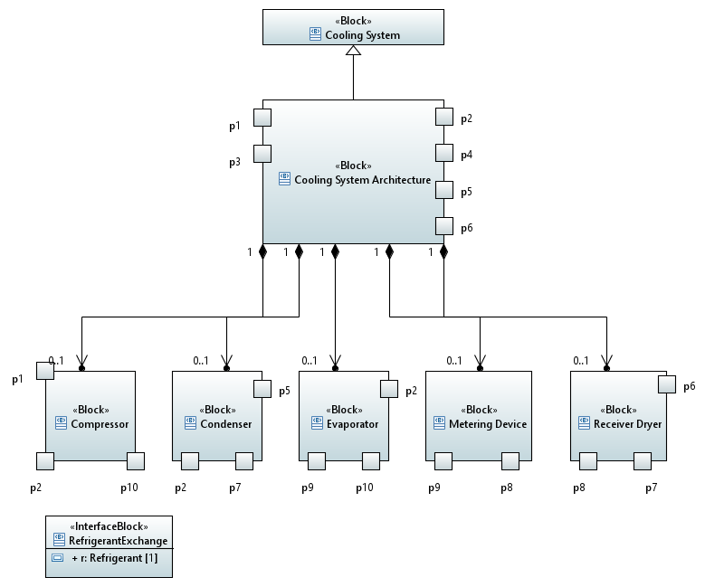

# RAMDE: Tarefa 2 - Relatório

## Introdução
Este projeto tem como objetivo modelar um sistema de controle climático de veículos (VCCS) a usar ferramentas de engenharia orientada a modelos. A tarefa é composta de dois principais objetivos: modelar o problema e a solução.

No projeto apresentado aborda-se alguns tópicos, tais como modelagem, *Black Box*, *White Box*, entre outros.

A modelagem refere-se ao processo de criar representações abstratas e gráficas de um sistema. Através da modelagem é possivel registar as nessecidades dos *stakeholders* e verificar se as soluões desenvolvidas estão de acordo com as suas exigências. Algumas das ferramentas mais utilizadas na modelagem são: 
- SysML (*Systems Modeling Language*) 
- UML (*Unified Modeling Language*)

Relativamente á perpectiva *Black Box*, esta refere-se a uma visão externa do sistema, ou seja, modela-se como o sistema interage com o ambiente ao seu redor, com as suas entradas e saídas e com as suas principais funcionalidades.

Em relação á perspetiva *White Box*, dá uma visão mais interna do sistema, especifica a arquitetura do sistema, e como os seus componentes interagem entre si.

## Problema

Desenvolver um modelo do problema e da solução de sistema de controle climático para veículos que seja eficiente, seguro e confiável. 

## Requerimentos da tarefa

- Instalar e configurar as ferramentas necessárias, como Eclipse, Papyrus e Git.
- Modelar o problema
    - Capturar as Necessidades dos Stakeholders
    - Modelar o Contexto do Sistema
    - Modular o Comportamento de um Use Case
    - Criar Internal Block Diagram
    - Capturar as Measures of Effectiveness (MoE)
- Modelar a solução
    - Criar Requisitos do Sistema
    - Relacionar os Requisitos do Sistema e as necessidades das partes interessadas
    - Criar uma Arquitetura de alto nível do Sistema
    - Modelar os Requisitos do Subsistema
    - Modelar a Estrutura do Subsistema
    - Modelar o Comportamento do Subsistema (com máquinas de estado)
    - Modelar os Parâmetros do Subsistema
- Elaborar uma análise teórica da segurança e da fiabilidade

## Design da solução

Segue-se o design da nossa solução.

Este projeto é composto por dois modelos principais: VehicleCCU_Problem e VehicleCCU_Solution1.

O modelo VehicleCCU_Problem representa o problema e inclui tanto uma abordagem Black Box como White Box. Além disso, está estruturado nas seguintes pastas:

Por sua vez, a solução VehicleCCU_Solution1 está organizada da seguinte forma:

## Implementação da solução

### Problema

De seguida, analisa-se as necessidades de cada Stakeholder, mapeia-se os principais casos de uso e tenta-se compreender como cada parte do sistema precisa colaborar para dar conta dessas necessidades.

1. Necessidades dos Stakeholders

2. Contexto do Sistema

3. Comportamento de um Use Case

4. Internal Block Diagram

5. Measures of Effectiveness (MoE)

### Solução

Nas imagens seguintes apresenta-se a solução:

1. Requisitos do sistema

2. Requisitos do sistema e as necessidades das partes interessadas

3. Arquitetura de alto nível do sistema

4. Requisitos do subsistema

5. Estrutura do subsistema

6. Comportamento do subsistema (com máquinas de estado)

7. Parâmetros do subsistema

### Análise teórica da segurança e da fiabilidade

Conforme apresentado no Anexo A, identificam-se diversos requisitos e melhorias que podem aumentar a segurança e a fiabilidade do sistema de Controlo de Clima Veicular (VCCU), proporcionando maior proteção para os utilizadores e reduzindo os riscos de falhas.

#### 1. Especificação de Requisitos de Segurança e Fiabilidade

A especificação de requisitos de segurança e fiabilidade define os critérios mínimos que o sistema deve cumprir para garantir a protecção dos passageiros e o funcionamento consistente do sistema de controlo climático. Estes requisitos são formulados com base em normas de segurança e fiabilidade e incluem:

- **Aquecimento Rápido do Ar (SN-1.3.1)**: O VCCU deve ser capaz de aquecer o ar até à temperatura desejada dentro de 5 minutos, garantindo conforto ao utilizador, especialmente em climas frios.

- **Protecção contra Incêndio (SN-1.3.2.1)**: O sistema deve ser construído com materiais e componentes que não iniciem um incêndio e que não contribuam para a propagação de chamas em caso de falha, minimizando riscos de acidentes graves.

- **Prevenção de Biofouling (SN-1.3.2.2)**: Os materiais e o fluxo de ar dentro do sistema não devem acumular toxinas ou alergénios prejudiciais à saúde dos passageiros, evitando riscos de reacções alérgicas e problemas respiratórios.

Estes requisitos visam garantir que o VCCU opere de forma segura e eficaz, minimizando riscos potenciais para os ocupantes e assegurando uma experiência de utilização fiável.

#### 2. Identificação de Riscos e Análise de Consequências

A identificação de riscos e a análise de consequências mapeiam cenários de falhas que possam comprometer a segurança e a fiabilidade do sistema, além de determinar as potenciais repercussões desses eventos. Com base nas falhas listadas, os principais riscos incluem:

- **Risco de Incêndio por Sobreaquecimento (F-1)**
  - **Causa**: Falha interna no VCCU que leva ao sobreaquecimento.
  - **Consequências**: Risco de propagação de incêndio, emissão de fumo tóxico e falha do sistema, resultando em queimaduras, intoxicação por fumo e acidentes graves durante a condução.
  - **Impacto**: Alto, comprometendo a integridade física dos passageiros e a segurança geral do veículo.

- **Risco de Exposição a Alergénios e Materiais Tóxicos (F-2)**
  - **Causa**: Acumulação de materiais tóxicos ou alergénios dentro do VCCU, libertados no fluxo de ar.
  - **Consequências**: Pode causar desconforto e reacções alérgicas nos passageiros, além de potenciais efeitos de longo prazo na saúde.
  - **Impacto**: Médio a alto, afectando directamente o bem-estar e a saúde dos ocupantes.

- **Risco de Aquecimento Insuficiente (F-3)**
  - **Causa**: Falta de potência de aquecimento ou grande diferença entre a temperatura ambiente e a desejada.
  - **Consequências**: Passageiros sentem desconforto térmico, especialmente em climas frios.
  - **Impacto**: Médio, afectando o conforto dos passageiros, mas não comprometendo directamente a segurança física.

- **Falhas Operacionais Diversas (F-4 a F-8)**
  - **Causa**: Falhas em sensores, na activação do sistema, ou na circulação do ar condicionado.
  - **Consequências**: O VCCU não consegue manter a temperatura adequada, causando desconforto e, em casos extremos, falhas operacionais que podem afectar a condução do veículo.
  - **Impacto**: Variável, com impacto médio em conforto e operacionalidade.

#### 3. Planeamento de Medidas de Mitigação

As medidas de mitigação são estratégias implementadas para minimizar os riscos identificados, mantendo o sistema seguro e funcional. As medidas de mitigação para o VCCU incluem:

- **Para o Risco de Incêndio (F-1)**
  - **Utilização de Materiais Resistentes ao Fogo**: Selecção de componentes e materiais internos resistentes a altas temperaturas e não inflamáveis.
  - **Sistema de Monitorização de Temperatura**: Instalação de sensores para monitorizar a temperatura interna do VCCU, com alertas ou desligamento automático em caso de sobreaquecimento.

- **Para o Risco de Biofouling e Exposição a Alergénios (F-2)**
  - **Instalação de Filtros de Ar de Alta Eficiência**: Implementação de filtros que removam alergénios e partículas tóxicas antes do ar circular na cabine.
  - **Programa de Manutenção Preventiva**: Estabelecimento de uma rotina de limpeza e substituição de componentes para evitar o acumular de biofouling.

- **Para o Risco de Aquecimento Insuficiente (F-3)**
  - **Aquisição de Sistemas de Aquecimento Auxiliares**: Em caso de incapacidade do VCCU de aquecer adequadamente, sistemas auxiliares podem complementar a função de aquecimento.
  - **Aprimoramento da Eficiência Térmica**: Optimização da distribuição de calor para um desempenho mais consistente.

- **Para Falhas Operacionais Diversas (F-4 a F-8)**
  - **Modos de Operação em Falha Segura (Fail-Safe)**: Implementação de modos de operação que permitam o funcionamento com configurações mínimas de segurança em caso de falha, como um modo “limp” que mantém a ventilação básica.
  - **Sistema de Diagnóstico e Alerta**: Desenvolvimento de sistema de alerta que notifique o condutor sobre falhas no VCCU, com orientações para reparos ou assistência técnica.
  - **Verificação de Sensores**: Garantia de calibração e funcionamento correcto dos sensores (de temperatura, fluxo de ar, etc.) para evitar problemas de monitorização que comprometam o sistema.

## Solução alternativa

Uma solução alternativa para o sistema poderia ser projetada com ênfase na segurança, assegurando uma proteção robusta e minimizando os riscos associados a falhas.

## Implementação alternativa

Assim como na solução proposta, a implementação deve priorizar a segurança, garantindo que todas as atividades sejam submetidas a rigorosos processos de controle.

## Observações finais e reflexão critica

Esta implementação cumpriu os objetivos principais de modelagem dos requisitos e geração de diagramas UML, promovendo uma estrutura organizada e modular para a representação dos componentes do sistema de controle de clima, incluindo os aspectos de requisitos e arquitetura de alto nível. \
Neste projeto, aprendemos a utilizar ferramentas como o Eclipse Papyrus e técnicas como diagramas de caso de uso e diagramas de atividades, adquiri experiência prática em traduzir requisitos de stakeholders em modelos detalhados e compreensíveis. O uso de perspectivas de caixa preta e caixa branca aprimorou minha capacidade de analisar o sistema tanto em nível de comportamento quanto de estrutura interna. Além disso, a análise de segurança e confiabilidade me mostrou a importância de projetar sistemas robustos e seguros.

## Contribuição dos membros

### Estudante 1: 1240160 - Nuno Castro

### Estudante 2: 1201560 - Reinaldo Reis