# RAMDE: Tarefa 3 - Relatório

## Introdução

O objetivo deste projeto é desenvolver linguagens de modelagem para máquinas de estados de Moore e Mealy. Este relatório descreve as etapas, requisitos e abordagens para criar metamodelos para esses tipos de máquinas de estados e a inclusão de restrições OCL para evitar modelos inválidos.

### Máquina de Estados

Uma máquina de estados, também conhecida como máquina de estados finitos, é um modelo matemático usado para representar sistemas que têm um número finito de estados diferentes. Este modelo direciona o funcionamento de um sistema com base em diferentes estados, onde cada estado representa uma condição importante do sistema. As máquinas de estados podem ser divididas em duas categorias principais:

- Máquinas de Mealy
- Máquinas de Moore

### Máquinas de Mealy
Uma máquina de estados Mealy é um modelo em que a saída depende tanto do estado atual quanto da entrada. Isso significa que a saída é gerada durante a transição entre estados. As máquinas de Mealy são amplamente utilizadas em sistemas de interação entre usuário e computador.

### Máquinas de Moore
Uma máquina de estados Moore é um modelo em que a saída depende exclusivamente do estado atual, independente da entrada. Essas máquinas são muito utilizadas em sistemas de automação sequencial.

### Principais Diferenças entre Mealy e Moore
A principal diferença entre os dois modelos é que, enquanto a saída em Mealy depende do estado atual e da entrada, em Moore depende apenas do estado atual. Isso significa que, em Moore, uma mudança na entrada só afeta a saída na próxima transição de relógio, enquanto em Mealy as saídas mudam imediatamente em resposta a alterações na entrada.

### Metamodelo 

Um metamodelo é um modelo de um modelo. Este define a estrutura, as regras e os elementos que podem ser utilizados para criar modelos. Ou seja, um metamodelo descreve os componentes e as relações que formam o modelo.

O metamodelo é essencial para manter a consistência e a integridade dos modelos, especialmente em domínios onde a complexidade é alta e os erros podem ter consequências muito graves.

### Importância de OCL em Modelagem 

Incorporar OCL em modelos ajuda  agarantir que todos os elementos criados tenham em consideração certos requisitos de integridade, evitando erros que poderiam comprometer o funcionamento do sistema.

## Problema

Modelar sistemas baseados em máquinas de estados apresenta desafios, como a representação precisa dos comportamentos distintos das máquinas de estados Moore e Mealy. Este projeto aborda a necessidade de criar uma linguagem de modelagem eficiente que capture as especificidades e diferenças entre esses modelos.

## Requerimentos da tarefa

1. Criação de metamodelos para máquinas de estados Moore e Mealy.
2. Inclusão de restrições OCL nos metamodelos para evitar a criação de modelos inválidos.

## Design da solução

### Mealy
Para realizar o design da solução, utilizamos como base o diagrama a seguir:

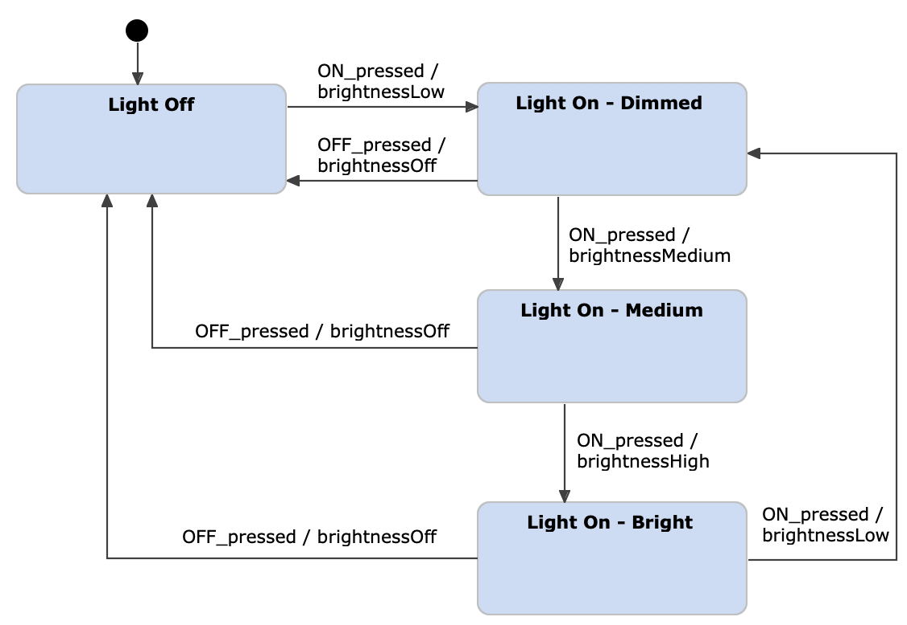

No modelo Mealy, observamos que:

- O diagrama tem um titulo.
- O estado possui um **nome** e pode ter **transições** associadas.
- A transição contém um **nome**, um **output** e está vinculada a um evento.
- O evento possui um **nome**.

Com essa estrutura, traduzimos esses elementos para o seguinte modelo final:

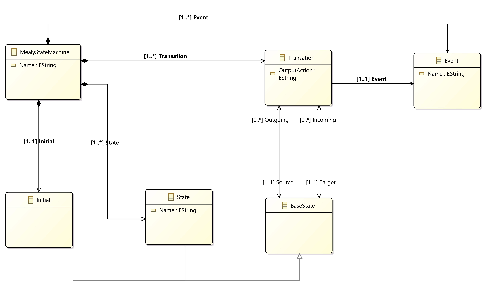

### Moore
Para o design da máquina de estados Moore, utilizamos a seguinte imagem como referência:

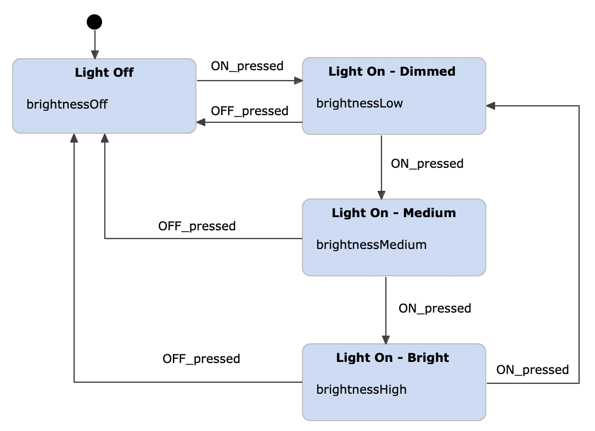

Embora semelhante ao modelo Mealy, há uma diferença fundamental: no modelo Moore, o **output** está associado diretamente ao estado, e não à transição. Isso reflete a característica do modelo Moore, onde as saídas dependem apenas do estado atual, sem considerar eventos ou transições.

A estrutura final desse modelo é a seguinte:

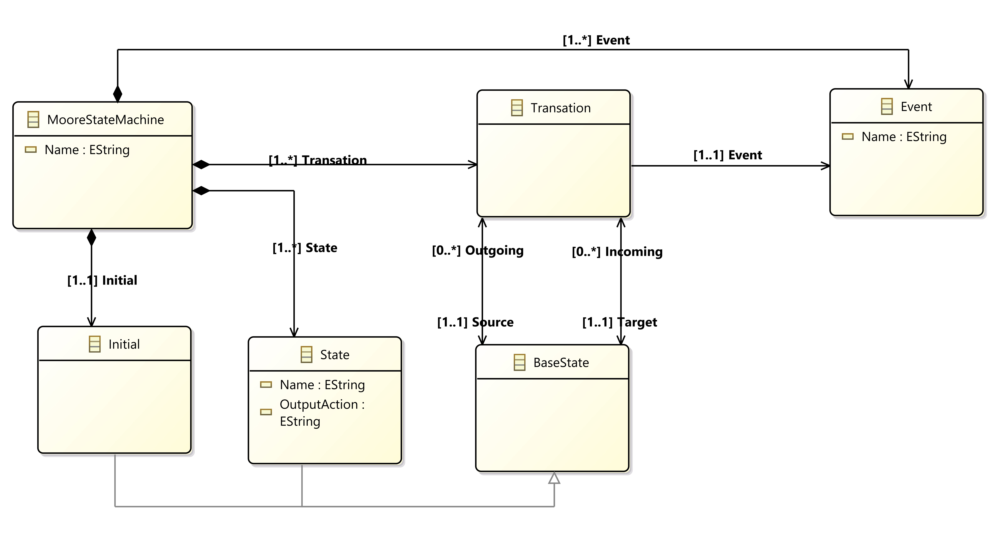

### Restrições OCL
Para melhorar a modelagem e garantir a integridade dos modelos, definimos as seguintes restrições OCL (Object Constraint Language):

1. Todos os nomes devem começar com a primeira letra em maiúsculo e ter mais de 3 caracteres.
2. O output não pode ser nulo.
3. Nas transições, o estado de origem deve ser diferente do estado final.
4. Todos os estados devem ter nomes únicos.
5. Todas as transições devem ser únicas.
6. Todos os eventos devem ser únicos.
7. O estado inicial não pode ter uma transição de entrada.
8. Cada estado deve possuir pelo menos uma transição de entrada.
9. Todos os estados devem ser alvo de pelo menos uma transição.

Essas restrições OCL asseguram que nossos modelos sejam válidos e correspondam ao comportamento esperado para máquinas de estados Moore e Mealy.

## Solution Implementation

### Mealy

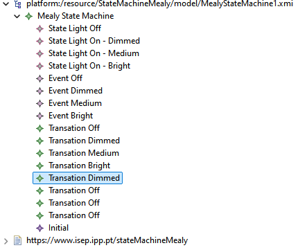

### Moore

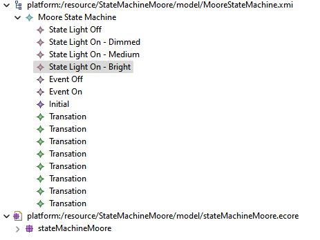

## Solution Alternative(s)

1. Solução alternativa

Para uma solução alternativa, podemos considerar outros diagrama com o seguinte:

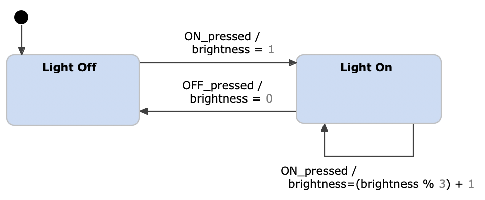

Nesta diagrama, o modelo é reduzido a dois estados principais: **On** e **Off**. As transições são otimizadas para facilitar o entendimento e a eficácia do modelo, sendo:

- **Início para Off**: Representa a ativação inicial do sistema.
- **Off para On**: Liga o sistema a partir do estado desligado.
- **On para Off**: Desliga o sistema a partir do estado ligado.
- **On para On** (transição repetida): Sempre que o sistema permanece no estado ligado, ocorre um aumento progressivo na intensidade da luz.

Para esta solução teriamos apenas de remover a restrição "3. Nas transições, o estado de origem deve ser diferente do estado final.".

2. Solução alternativa

Outra abordagem alternativa para simplificar o modelo seria considerar o **estado inicial** como um estado, eliminando a necessidade de uma classe ou estrutura separada para o **estado inicial**. Além disso, teriamos de adicionar uma nova restrição para garantir que haja apenas um estado sem transição de entrada.

### Mealy

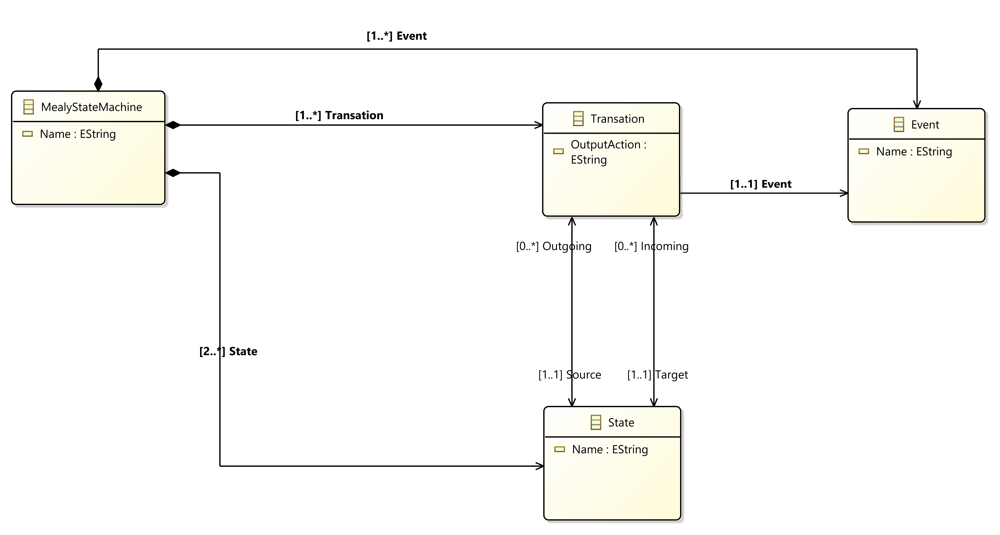

### Moore

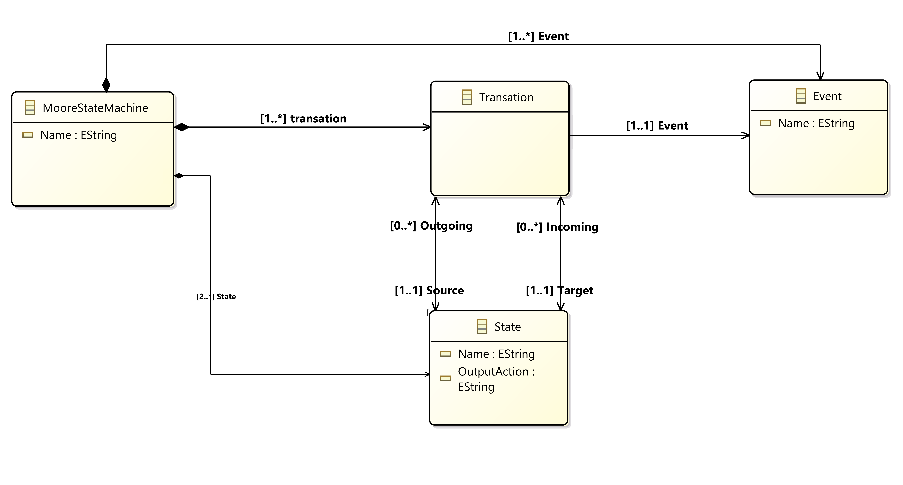

## Implementação alternativa

A implementação da solução alternativa 1 resultaria nos seguintes modelos:

### Mealy

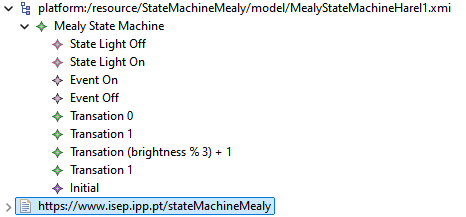

### Moore

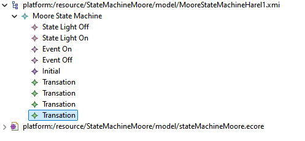

## Observações finais e reflexão critica

O desenvolvimento dos metamodelos para máquinas de estados Moore e Mealy destacou a importância das restrições OCL na prevenção de erros de modelagem e evidenciou a necessidade de um planejamento estruturado para criar linguagens de modelagem eficazes. A experiência com o Eclipse e as restrições OCL forneceu uma compreensão valiosa das práticas de modelagem e das necessidades de validação de requisitos em sistemas complexos.

## Contribuição dos membros

### Student 1: 1240160 - Nuno Castro

### Student 2: 1201560 - Reinaldo Reis