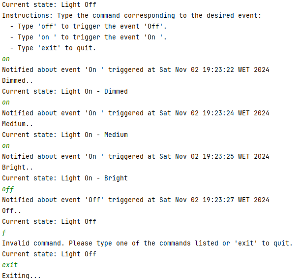
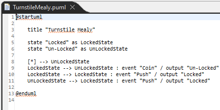
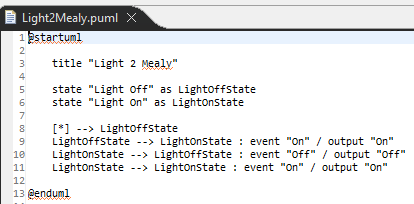

# RAMDE: Tarefa 4 - Relatório

## Introdução

Este projeto tem como objetivo desenvolver um sistema capaz de transformar modelos de máquinas de estado em código Java executável. Para isso, usa-se modelos de máquinas de estado de Moore e Mealy (criados na tarefa P3) e a biblioteca Easy-States (analisada na tarefa P1).

Esse processo, chamado de transformação de modelos, converte o modelo de estado em código Java. Além disso, usaremos o PlantUML para gerar diagramas que representam visualmente as máquinas de estado  com base nas descrições textuais.

## Problema

O problema apresentado neste trabalho é a necessidade de transformar modelos de máquinas de estado de Moore e Mealy, desenvolvidos em tarefas anteriores, em código Java executável. Este processo envolve várias etapas, incluindo a criação de um projeto para executar transformações de modelos, a geração de arquivos PlantUML para representar visualmente os modelos e a produção de código Java que reutiliza a biblioteca Easy-States.

## Requerimentos da tarefa

- Criar um projeto para executar transformações de modelo em qualquer modelo expresso de acordo com o metamodelo desenvolvido na PL3.
- Gerar código Java executável correspondente ao modelo recebido como entrada e que reutiliza a biblioteca Easy-States.
- Gerar um PlantUML representando o modelo recebido como entrada.

## Design da solução

Para a implementação desta solução, criamos dois projetos distintos: um para o **Mealy** e outro para o **Moore**.

### Estrutura de pastas

Dentro de cada projeto (Moore e Mealy), organizamos a pasta `src` com as seguintes subpastas:

- **uml**: contém a implementação para gerar o diagrama UML.
- **java**: contém o código responsável pela geração dos ficheiros Java.
- **main**: executa o código que gera tanto o código Java quanto o diagrama UML.

Além disso, há a pasta `src-gen`, onde todo o código gerado é armazenado.

## Implementação da solução

### Mealy

#### Gerar código Java

Na implementação do Mealy, temos os seguintes ficheiros:

- `generate`, `generateJava`, `generateJavaEvent`, `generateJavaHandler`, `generateJavaMain`, e `query`.

No ficheiro **query**, há várias query's para reutilização, facilitando a manutenção do código.

Os ficheiros **generateJavaEvent**, **generateJavaHandler** e **generateJavaMain** contêm a lógica de criação das classes Java, permitindo uma estrutura modular e reutilizável. Por exemplo, no ficheiro que cria as classes de eventos (**Event**), há uma implementação específica para facilitar a reutilização do código.

A função do ficheiro **generateJava** coordena a execução dos outros ficheiros, garantindo que todos os componentes do projeto sejam gerados corretamente.

A função do ficheiro **generate** atua como ponto de entrada principal, chamando tanto `generateJava` quanto `generatePlantUML`.

##### Teste com Exemplos

###### Exemplo 1

Para o primeiro exemplo, utilizamos o seguinte diagrama como base:

A partir desse diagrama, geramos instâncias dinâmicas e, em seguida, o código. A estrutura gerada ficou organizada da seguinte forma:

Depois de gerar o código, copiamos a pasta para o projeto **easy-states-master** dentro de `src\main\java\org\jeasy\states`. Ao executar o código, obtivemos o seguinte resultado:

###### Exemplo 2

Para o segundo exemplo, o diagrama usado foi:

Assim como no exemplo anterior, geramos as instâncias dinâmicas e o código, resultando na seguinte estrutura:

Ao copiar a pasta gerada para **easy-states-master** e executá-la, o resultado foi:

###### Exemplo 3

No terceiro exemplo, utilizamos este diagrama:

A geração das instâncias e do código resultou na estrutura:

O resultado da execução no **easy-states-master** foi:

#### Gerar UML

Para a geração do diagrama UML, usamos as funções `generate`, `generatePlantUML` e `query`.

O ficheiro **query** define consultas reutilizáveis para facilitar a manutenção do código. 

O **generatePlantUML** é responsável por gerar o diagrama UML, enquanto o ficheiro principal **generate** coordena a execução.

##### Teste com Exemplos

###### Exemplo 1

Para o primeiro exemplo, utilizamos o seguinte diagrama como base:

A partir desse diagrama, geramos instâncias dinâmicas e, em seguida, o UML. A estrutura gerada ficou organizada da seguinte forma:

Por fim o resultado é o seguinte:

Que equivale a:

###### Exemplo 2

Para o segundo exemplo, utilizamos o seguinte diagrama como base:

A partir desse diagrama, geramos instâncias dinâmicas e, em seguida, o UML. A estrutura gerada ficou organizada da seguinte forma:

Por fim o resultado é o seguinte:

Que equivale a:

###### Exemplo 3

Para o terceiro exemplo, utilizamos o seguinte diagrama como base:

A partir desse diagrama, geramos instâncias dinâmicas e, em seguida, o UML. A estrutura gerada ficou organizada da seguinte forma:

Por fim o resultado é o seguinte:

Que equivale a:

### Moore

#### Gerar código Java

Na implementação do Mealy, temos os seguintes ficheiros:

- `generate`, `generateJava`, `generateJavaEvent`, `generateJavaMain`, e `query`.

No ficheiro **query**, há várias query's para reutilização, facilitando a manutenção do código.

Os ficheiros **generateJavaEvent**, **generateJavaHandler** e **generateJavaMain** contêm a lógica de criação das classes Java, permitindo uma estrutura modular e reutilizável. Por exemplo, no ficheiro que cria as classes de eventos (**Event**), há uma implementação específica para facilitar a reutilização do código.

A função do ficheiro **generateJava** coordena a execução dos outros ficheiros, garantindo que todos os componentes do projeto sejam gerados corretamente.

A função do ficheiro **generate** atua como ponto de entrada principal, chamando tanto `generateJava` quanto `generatePlantUML`.

##### Teste com Exemplos

###### Exemplo 1

Para o primeiro exemplo, utilizamos o seguinte diagrama como base:

A partir desse diagrama, geramos instâncias dinâmicas e, em seguida, o código. A estrutura gerada ficou organizada da seguinte forma:

Depois de gerar o código, copiamos a pasta para o projeto **easy-states-master** dentro de `src\main\java\org\jeasy\states`. Ao executar o código, obtivemos o seguinte resultado:

###### Exemplo 2

Para o segundo exemplo, utilizamos o seguinte diagrama como base:

A partir desse diagrama, geramos instâncias dinâmicas e, em seguida, o código. A estrutura gerada ficou organizada da seguinte forma:

Depois de gerar o código, copiamos a pasta para o projeto **easy-states-master** dentro de `src\main\java\org\jeasy\states`. Ao executar o código, obtivemos o seguinte resultado:

###### Exemplo 3

Para o terceiro exemplo, utilizamos o seguinte diagrama como base:

A partir desse diagrama, geramos instâncias dinâmicas e, em seguida, o código. A estrutura gerada ficou organizada da seguinte forma:

Depois de gerar o código, copiamos a pasta para o projeto **easy-states-master** dentro de `src\main\java\org\jeasy\states`. Ao executar o código, obtivemos o seguinte resultado:

#### Gerar UML

Para a geração do diagrama UML, usamos as funções `generate`, `generatePlantUML` e `query`.

O ficheiro **query** define consultas reutilizáveis para facilitar a manutenção do código. 

O **generatePlantUML** é responsável por gerar o diagrama UML, enquanto o ficheiro principal **generate** coordena a execução.

###### Exemplo 1

Para o primeiro exemplo, utilizamos o seguinte diagrama como base:

A partir desse diagrama, geramos instâncias dinâmicas e, em seguida, o UML. A estrutura gerada ficou organizada da seguinte forma:

Por fim o resultado é o seguinte:

Que equivale a:

###### Exemplo 2

Para o segundo exemplo, utilizamos o seguinte diagrama como base:

A partir desse diagrama, geramos instâncias dinâmicas e, em seguida, o UML. A estrutura gerada ficou organizada da seguinte forma:

Por fim o resultado é o seguinte:

Que equivale a:

###### Exemplo 3

Para o terceiro exemplo, utilizamos o seguinte diagrama como base:

A partir desse diagrama, geramos instâncias dinâmicas e, em seguida, o UML. A estrutura gerada ficou organizada da seguinte forma:

Por fim o resultado é o seguinte:

Que equivale a:

## Solução alternativa

Uma possível alternativa seria consolidar os dois projetos (Moore e Mealy) em um único projeto. Isso simplificaria a gestão, embora pudesse dificultar a manutenção de cada abordagem.

## Implementação alternativa

Como alternativa de implementação, poderíamos configurar o gerador para não reescrever todo o código anterior, preservando alterações manuais feitas anteriormente. Além disso, o gerador poderia produzir o projeto completo, em vez de apenas partes dele.

## Observações finais e reflexão critica

Esta implementação atendeu aos objetivos principais de geração de código e diagramas UML, garantindo uma estrutura organizada e modular para os componentes de Mealy e Moore.

Com este trabalho, aprendemos a importância da integração entre diferentes fases de desenvolvimento, especialmente ao reutilizar o metamodelo e a biblioteca Java Easy-States para gerar código executável. O uso de ferramentas como o Eclipse Modeling Tools, com suporte para OCL e Acceleo, ajudo-nos a entender melhor o processo de transformação de modelos em código, o que reforça o valor da engenharia orientada a modelos para simplificar sistemas complexos. Além disso, explorar as limitações e testar diferentes modelos dá uma visão prática sobre os desafios de consistência e eficiência na geração automática de código.

## Contribuição dos membros

### Estudante 1: 1240160 - Nuno Castro

### Estudante 2: 1201560 - Reinaldo Reis