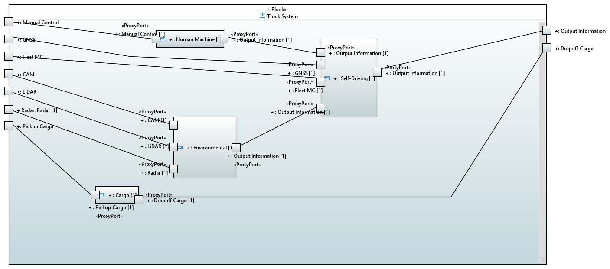
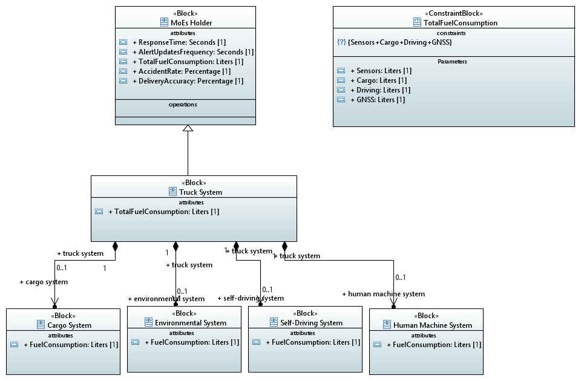

# RAMDE: Tarefa 5 - Relatório

## Glossário

| **Sigla** | **Termo** | **Significado** |
|---|---|---|
| **CAM** | Câmara | Dispositivo utilizado para captar imagens e auxiliar no reconhecimento de objetos e sinais de trânsito |
| **LiDAR** | Light Detection and Ranging | Tecnologia a laser que cria um mapa 3D do ambiente à volta do camião, detectando obstáculos e a distância dos objetos |
| **RADAR** | Radio Detection and Ranging | Tecnologia que usa ondas de rádio para medir a distância e a velocidade dos objetos à volta do camião |
| **PWM** | Pulse Width Modulation | Técnica utilizada para controlar a potência dos motores |
| **Fleet MC** | Fleet Management Control | Sistema de controlo de gestão de frotas utilizado para monitorizar e coordenar as operações de vários camiões autónomos |
| **GNSS** | CâmaraGlobal Navigation Satellite System | Sistema de navegação por satélite utilizado para determinar a localização do camião |
| **PL** | Prática laboratorial |
| **MoE** | Medidas de eficácia |
| **IA** | Inteligência artificial |
| **V2X** | Veículo para Tudo | Veículo para Tudo (V2X) refere-se à comunicação entre veículos e outros elementos externos, como infraestruturas, pedestres e dispositivos, visando melhorar a segurança, a eficiência e a experiência de condução ao permitir trocas de informações em tempo real. |

## Introdução

Um camião autónomo é um veículo de transporte equipado com uma tecnologia de condução automatizada, concebido para realizar viagens e entregas com pouca ou nenhuma intervenção humana. Através de sistemas avançados, como GNSS, radares, sensores LiDAR e inteligência artificial, estes camiões conseguem circular em estradas, detetar obstáculos, interpretar as condições de trânsito e executar manobras complexas.

Estes veículos são classificados em níveis de automação, que variam de 1 a 5. No nível mais básico, o camião possui apenas funções assistidas, como controlo de velocidade, mas requer a total atenção do condutor. No nível mais avançado, o veículo é totalmente autónomo, operando sem qualquer necessidade de intervenção humana.

Num futuro próximo, espera-se um crescimento significativo dos camiões autónomos, especialmente em rotas pré-determinadas, como autoestradas e zonas industriais.

O objetivo deste trabalho é desenvolver uma modelagem de um sistema de um camião autónomo. A realização desta modelagem é uma etapa fundamental no desenvolvimento de um camião autónomo, pois possibilita testar e validar as tecnologias de forma antecipada, garantindo maior segurança e eficiência durante o processo de desenvolvimento.

## Problema

O desafio apresentado consiste em abordar diferentes aspectos do desenvolvimento de um sistema para um camião autónomo. Para isso, o problema pode ser dividido em três áreas principais:

- **Modelagem do Problema e da Solução**: Desenvolver uma representação detalhada e estruturada do sistema do camião autónomo, abrangendo os seus requisitos, arquitetura e comportamento. Essa modelagem permitirá compreender e documentar as necessidades do sistema, bem como planejar a implementação das suas funcionalidades.
- **Geração Automática de Código**: Criar um processo que permita, a partir de um diagrama de máquina de estados, gerar automaticamente código em Java. Este processo visa acelerar o desenvolvimento, reduzir erros humanos e garantir que o código gerado seja consistente com a especificação modelada.
- **Implementação de Testes Automatizados**: Testes automatizados desempenham um papel crítico na validação e garantia de qualidade do software. O objetivo é implementar um conjunto abrangente de testes para verificar o comportamento do sistema, assegurando que ele atende aos requisitos especificados e opera de forma confiável em diferentes cenários.

## Requerimentos da tarefa

- Instalar e configurar as ferramentas necessárias, como Eclipse, Papyrus, Acceleo e Git.

- Modelar o problema
    - Capturar as Necessidades dos Stakeholders
    - Modelar o Contexto do Sistema
    - Modular o Comportamento de um Use Case
    - Criar Internal Block Diagram
    - Capturar as Measures of Effectiveness (MoE)

- Modelar a solução
    - Criar Requisitos do Sistema
    - Relacionar os Requisitos do Sistema e as necessidades das partes interessadas
    - Criar uma Arquitetura de alto nível do Sistema
    - Modelar os Requisitos do Subsistema
    - Modelar a Estrutura do Subsistema
    - Modelar o Comportamento do Subsistema (com máquinas de estado)
    - Modelar os Parâmetros do Subsistema

- Elaborar uma análise teórica da segurança e da fiabilidade

- Gerar código em Java

- Implementação de testes

## Design da solução

Para o desenvolvimento do projeto, foi utilizada a seguinte estrutura:

Criámos dois projetos: um para a modelação do problema (chamado **SelfDrivingTruck**) e outro para a geração do código (chamado **pt.ipp.isep.mescc.ramde.SelfDrivingTruck.acceleo**).

### Projeto de Modelação do Problema

No projeto dedicado à modelação do problema, existem dois modelos principais:
1. **SelfDrivingTruck_Problem**: Modelo que descreve o problema a ser resolvido.
2. **SelfDrivingTruck_Solution**: Modelo que define a solução para o problema identificado.

### Projeto de Geração de Código

No projeto responsável pela geração do código, a pasta `src` contém as seguintes subpastas:

- **files**: Contém as queries utilizadas para reduzir a duplicação de código e melhorar a modularidade.
- **java**: Contém o código necessário para gerar os ficheiros Java a partir da modelagem.
- **main**: Contém o ficheiro principal do programa, responsável por iniciar o processo de geração de código.

A pasta `src-gen` foi designada para armazenar o código gerado automaticamente durante o processo de execução.

## Solution Implementation

### Problema

#### Caixa Preta

A abordagem *Black Box* foca-se no comportamento externo do sistema, ignorando a sua estrutura interna. Analisa apenas as entradas e saídas, sendo particularmente eficaz para verificar o cumprimento dos requisitos funcionais.
Deste modo, aplica-se, de seguida, esta abordagem ao nosso cenário.

##### Necessidades das partes interessadas

As necessidades das partes interessadas representam os objetivos, expectativas e requisitos principais que o sistema deve atender para garantir o sucesso do projeto. Abaixo, detalham-se as necessidades identificadas, com foco em oferecer um sistema confiável, eficiente e seguro para a operação de um camião autónomo. Estas necessidades foram organizadas de forma a abranger funcionalidades cruciais, como autonomia, segurança, eficiência e desempenho, garantindo que o sistema atenda plenamente às demandas do mercado e dos seus utilizadores finais. A tabela a seguir apresenta uma visão estruturada de cada uma dessas necessidades:

| **ID** | **Título** | **Necessidade** |
|---|---|---|
| **SN-1** | SN-1 User Needs | O sistema de transporte autónomo deve satisfazer uma série de necessidades funcionais e operacionais para garantir segurança, eficiência e fiabilidade durante a sua operação. |
| **SN-1.1** | SN-1.1 Level 3 Autonomy | O sistema de condução autónoma deve ser capaz de operar no Nível 3 da norma SAE, permitindo o controlo autónomo com intervenção humana limitada apenas em situações específicas. |
| **SN-1.2** | SN-1.2 Level 4 Autonomy | O sistema de condução autónoma deve ser capaz de operar no Nível 4 da norma SAE, oferecendo controlo totalmente autónomo em áreas geograficamente definidas, sem necessidade de intervenção humana. |
| **SN-1.3** | SN-1.3 Dynamic Speed Control | O sistema de controlo de velocidade deve permitir ajustes dinâmicos, aumentando ou diminuindo a velocidade conforme necessário, para garantir segurança e eficiência na condução. |
| **SN-1.4** | SN-1.4 Automated Airbag System | O sistema deve ativar automaticamente os airbags quando detectar um acidente iminente, garantindo a protecção dos ocupantes do veículo. |
| **SN-1.5** | SN-1.5 Automatic Seat Belt Verification | O sistema deve verificar automaticamente se os cintos de segurança estão correctamente afivelados sempre que os ocupantes se sentarem nos seus lugares, garantindo a segurança de todos. |
| **SN-1.6** | SN-1.6 Cargo Transportation Capability | O sistema deve ser capaz de transportar cargas com precisão e segurança até ao destino desejado, cumprindo os requisitos de capacidade e segurança do transporte. |
| **SN-1.7** | SN-1.7 Secure Cargo Loading System | O sistema deve garantir que o carregamento da carga seja realizado de forma segura, sem riscos de danos à carga ou ao veículo. |
| **SN-1.8** | SN-1.8 Secure Cargo Unloading System | O sistema deve garantir que o descarregamento da carga seja feito de forma segura, minimizando os riscos de acidentes ou danos ao produto transportado. |
| **SN-1.9** | SN-1.9 Automated Preventive Maintenance | O sistema deve monitorizar automaticamente parâmetros como a pressão dos pneus, o nível de óleo, o estado da bateria e dos travões, alertando para a necessidade de manutenção preventiva quando necessário. |
| **SN-1.10** | SN-1.10 Quick Response to Unexpected Events | O sistema deve ser capaz de responder rapidamente a imprevistos, com um tempo máximo de resposta de 0,1 segundos, minimizando impactos e garantindo a continuidade da operação. |
| **SN-1.11** | SN-1.11 Instant Alerts and Reports | O sistema deve fornecer alertas em tempo real e relatórios instantâneos sobre o estado do veículo, garantindo que todas as partes interessadas possam acompanhar o funcionamento do sistema de forma eficaz. |
| **SN-1.12** | SN-1.12 Fuel Consumption Optimization | O sistema deve ser projetado para optimizar o consumo de combustível, reduzindo o consumo durante a operação e diminuindo assim os custos operacionais e o impacto ambiental. |
| **SN-1.13** | SN-1.13 Accident Rate Reduction | O sistema deve manter uma taxa de acidentes inferior a 1% em comparação com os padrões da indústria, garantindo elevados níveis de segurança nas operações. |
| **SN-1.14** | SN-1.14 On-Time Delivery | O sistema deve garantir que as entregas sejam realizadas dentro ou antes do prazo previsto, com uma taxa de sucesso superior a 99%, cumprindo os requisitos de pontualidade e eficiência. |

##### Contexto do sistema

O contexto do sistema fornece uma visão geral dos elementos externos que interagem diretamente com o **Truck System** e como essas interações ocorrem. Este modelo destaca os principais atores e sistemas externos que fornecem informações, tomam decisões ou monitoram o desempenho do sistema.

No caso do nosso projeto, o **Truck System** encontra-se no centro do diagrama, recebendo suporte de entradas externas críticas, como o GNSS, que fornece dados essenciais de localização, e o Fleet MC, responsável por coordenar e supervisionar a operação da frota. Além disso, o sistema é complementado pela supervisão humana, garantindo que as operações estejam alinhadas com os objetivos e critérios de segurança esperados.

Esse contexto estabelece as bases para a integração eficiente e segura de todos os elementos que suportam o funcionamento do **Truck System**.

##### Casos de Uso

Em relação aos Casos de Uso, o seguinte diagrama fornece uma visão clara do fluxo operacional do sistema, no contexto do transporte de uma carga. Pode-se vizualizar que este diagrama destaca a interação entre subprocessos internos e elementos externos( supervisão humana, GNSS, Fleet MC, Ambiente).

##### Diagrama de Atividades

O diagrama de atividades combina de forma eficaz a **tomada de decisão estratégica** com a **execução operacional**, refletindo como o **Truck System** interage com o **Fleet Management Center (Fleet MC)** e outros elementos externos para realizar o transporte de carga. No cenário proposto, o **Fleet MC** é responsável por decidir o momento de enviar o camião, enquanto o **Truck System** executa todas as operações relacionadas à recolha, transporte e entrega da carga.  

O diagrama ilustra um fluxo contínuo e coordenado entre os subprocessos internos do sistema e as instruções recebidas de fontes externas, garantindo um transporte seguro e eficiente.  

###### Fluxo de Dados

Os principais fluxos de dados que suportam as atividades são os seguintes:  

- **EnvData (Dados Ambientais):**  
  Fornece informações contínuas sobre as condições externas, incluindo clima, estado das estradas, presença de obstáculos e status operacional do camião.  

- **CargoManifest (Manifesto de Carga):**  
  Detalha informações relacionadas à carga, como origem, destino, peso e tipo, garantindo que o transporte seja planejado de forma precisa.  

- **EnterHubCmd / ExitHubCmd:**  
  Comandos específicos que orientam o camião a entrar ou sair de hubs (como pontos de origem ou destino).  

- **DispatchCmd:**  
  O comando inicial enviado pelo sistema de gestão de frota, autorizando o despacho do camião para iniciar a operação.  

Este diagrama representa o alinhamento entre os comandos estratégicos e as ações executadas no nível operacional, assegurando que todas as atividades sejam realizadas de forma sincronizada e com eficiência máxima.  

##### Medidas de eficácia (MoE)

Para complementar a análise **Black Box**, foi implementado um diagrama de **Medidas de Eficácia (MoE)**. Este diagrama tem como objetivo avaliar os aspectos críticos de desempenho e sucesso do sistema, garantindo que ele atenda aos requisitos e expectativas estabelecidos pelas partes interessadas.  

As MoE fornecem métricas quantitativas e qualitativas para avaliar a eficácia operacional do **Truck System** em seu contexto de operação, contribuindo para a validação das funcionalidades e a identificação de possíveis melhorias.  

#### Caixa Branca

Relativamente à abordagem White Box, esta analisa o funcionamento interno do sistema, investigando a lógica, a estrutura e os fluxos internos. É utilizada para garantir que cada componente interno funcione corretamente. Assim, esta abordagem é aplicada no nosso contexto.

##### Decomposição funcional

O diagrama a seguir detalha o processo operacional relacionado ao **Self-Drive Transport Cargo**, destacando as etapas e interações envolvidas no transporte autônomo de carga. Ele representa os estados, transições e decisões durante a missão, além de processos como verificação de navegação, monitorização do ambiente e comunicação com o destino.

Analisando o diagrama podemos verificar:

1. Planeamento inicial:

    - O sistema recebe informações sobre a carga e o comando para iniciar o transporte.

    - Com base nesses dados, é feita a definição da rota que o veículo autónomo deve seguir.

2. Ativação da condução autónoma:

    - Após o planeamento, o veículo entra em modo de condução autónoma e começa a percorrer a rota estabelecida.

3. Monitorização do trajeto:

    - Durante o percurso, o sistema verifica continuamente:
        - Se o destino foi atingido.
        - Se há obstáculos no caminho, processando dados captados pelos sensores.

4. Reação a obstáculos:

    - Se for detetado um obstáculo, o sistema para e recalcula a rota, garantindo que o veículo possa prosseguir de forma segura.
    - Caso não haja obstáculos, o sistema continua a atualizar a posição do veículo.

5. Finalização do transporte:

    - Quando o veículo chega ao destino, o sistema desativa a condução autónoma e executa os comandos necessários para concluir o processo.

##### Interfaces conceptuais

As interfaces conceptuais do sistema descrevem como os diversos componentes externos interagem com o **Truck System**, estabelecendo fluxos claros de informações e comandos. Essas interfaces são fundamentais para garantir a conectividade e o funcionamento coordenado entre os elementos externos e internos do sistema.  

O diagrama a seguir ilustra as principais interfaces do sistema, destacando os atores externos e seus papéis na operação do **Truck System**. Ele também representa como essas conexões são integradas no contexto operacional do transporte autônomo de carga.

##### Subsistemas conceptuais

O diagrama apresentado abaixo representa o funcionamento do sistema do camião, evidenciando como os seus componentes trabalham em conjunto. Algumas caracteristicas do diagrama são as seguintes: 

- Recebe informações externas: Dados ambientais provenientes de sensores, localização via GPS, comandos do utilizador ou instruções do Fleet MC.

- Processa essas informações: O sistema principal analisa os dados recebidos para coordenar as suas funções.

- Toma decisões: Realiza ações como deslocar-se autonomamente, evitar obstáculos, ajustar rotas ou gerir a carga.

- Interage com sistemas externos: Conclui tarefas, tal como entregar mercadorias.

##### Medidas de Eficácia (MoE) dos subsistemas

As **Medidas de Eficácia (MoE)** ajudam a avaliar a eficácia de cada subsistema em atender aos requisitos operacionais e de desempenho, permitindo uma análise quantitativa do sucesso de cada componente. Essas métricas são vitais para a tomada de decisões durante a operação e para a melhoria contínua do sistema.

O diagrama a seguir detalha como as **métricas de eficácia** são organizadas e avaliadas nos diferentes componentes do **Truck System**. Essas métricas incluem parâmetros essenciais como tempo de resposta, consumo de combustível, precisão nas entregas, entre outros, que são fundamentais para garantir o desempenho otimizado do sistema.

##### Rastreabilidade das necessidades das partes interessadas

A **Rastreabilidade** garante que cada entrega, requisito e atividade do projeto esteja alinhada com as expectativas e necessidades dos stakeholders. Ao manter uma conexão clara entre os requisitos do sistema e as necessidades das partes interessadas, a rastreabilidade assegura que o desenvolvimento do sistema seja eficaz e esteja sempre direcionado para a satisfação dos objetivos definidos.  

A imagem a seguir ilustra como a rastreabilidade foi aplicada no projeto, destacando todas as relações e conexões entre os requisitos do sistema, as funções implementadas e as medidas de eficácia (MoEs), garantindo que cada elemento do projeto esteja adequadamente atendendo às necessidades dos stakeholders.

### Solução

#### Nível do sistema

Nesta seção, são apresentados os detalhes da solução no contexto do nível do sistema, descrevendo como os requisitos identificados serão atendidos. A abordagem adota uma visão ampla que considera tanto as funcionalidades técnicas quanto os objetivos estratégicos.

##### Requisitos do sistema

Os requisitos do sistema especificam as funcionalidades essenciais que o **Truck System** deve atender para alinhar-se às necessidades das partes interessadas. Esses requisitos abrangem aspectos como segurança, autonomia, eficiência, capacidade de transporte, manutenção e confiabilidade. A tabela abaixo organiza esses requisitos de forma clara, destacando os objetivos específicos de desempenho e operação do sistema.

| **ID** | **Título** | **Requesito** |
|---|---|---|
| **SR-1.1** | SR-1.1 Level 3 Autonomy | Quando o sistema de condução autónoma está em operação, deverá ser capaz de operar no Nível 3 da norma SAE, permitindo controlo autónomo com intervenção humana limitada.  |
| **SR-1.2** | SR-1.2 Level 4 Autonomy | Quando o sistema de condução autónoma está em operação, deverá ser capaz de operar no Nível 4 da norma SAE, oferecendo controlo totalmente autónomo em áreas geograficamente definidas, sem necessidade de intervenção humana.  |
| **SR-1.3** | SR-1.3  Dynamic Speed Control | Sempre que necessário, o sistema deverá ajustar dinamicamente (aumentar ou diminuir) a velocidade para garantir segurança e eficiência na condução.  |
| **SR-1.4** | SR-1.4 Automated Airbag System | Quando um acidente iminente for detetado, o sistema deverá ativar automaticamente os airbags para assegurar a proteção dos passageiros.  |
| **SR-1.5** | SR-1.5 Automatic Seat Belt Verification | Sempre que os passageiros ocuparem os seus assentos, o sistema deverá verificar automaticamente se os cintos de segurança estão corretamente colocados para garantir a segurança de todos os ocupantes.  |
| **SR-1.6** | SR-1.6 Cargo Transportation Capability | Quando solicitado, o sistema deverá transportar cargas até ao local de destino desejado com precisão e segurança.  |
| **SR-1.7** | SR-1.7 Secure Cargo Loading System | Sempre que a carga for carregada, o sistema deverá garantir que o processo seja realizado de forma segura.  |
| **SR-1.8** | SR-1.8 Secure Cargo Unloading System | Sempre que a carga for descarregada, o sistema deverá garantir que o processo seja realizado de forma segura.  |
| **SR-1.9** | SR-1.9 Automated Preventive Maintenance | Sempre que necessário, o sistema deverá monitorizar automaticamente a pressão dos pneus, o nível de óleo, a saúde da bateria e o estado dos travões, alertando sobre a necessidade de manutenção preventiva.  |
| **SR-1.10** | SR-1.10 Quick Response to Unexpected Events | Sempre que uma situação inesperada ocorrer, o sistema deverá responder no tempo máximo de 0,1 segundos para minimizar o impacto.  |
| **SR-1.11** | SR-1.11  Instant Alerts and Reports | Sempre que houver mudanças relevantes no estado do veículo, o sistema deverá fornecer alertas e relatórios atualizados para facilitar o acompanhamento do seu funcionamento.  |
| **SR-1.12** | SR-1.12 Fuel Consumption Optimization | Sempre que o sistema estiver em operação, deverá otimizar o consumo de combustível para utilizar a menor quantidade possível, reduzindo custos e impacto ambiental.  |
| **SR-1.13** | SR-1.13  Accident Rate Reduction | Sempre que estiver em operação, o sistema deverá manter uma taxa de acidentes inferior a 1% em relação ao padrão da indústria para assegurar altos níveis de segurança.  |
| **SR-1.14** | SR-1.14 On-Time Delivery | Sempre que realizar entregas, o sistema deverá cumpri-las dentro do prazo previsto ou antes, garantindo uma taxa de sucesso superior a 99%.  |

##### Rastreabilidade: Requisitos do sistema para as necessidades das partes interessadas

A rastreabilidade entre os requisitos do sistema e as necessidades das partes interessadas é uma etapa crítica para assegurar que as funcionalidades projetadas atendam às expectativas de todos os *stakeholders*. Este mapeamento ajuda a verificar que cada necessidade foi devidamente traduzida em requisitos técnicos e promove um alinhamento direto entre os objetivos estratégicos e a implementação técnica. O diagrama a seguir apresenta a ligação clara entre essas dimensões.

##### Arquitetura de sistema de alto nível

A arquitetura de alto nível do sistema fornece uma visão estruturada e simplificada dos principais componentes do Truck System, suas interações e como cada elemento contribui para o funcionamento global do sistema. Esta abordagem permite identificar as principais funcionalidades, estabelecer interfaces bem definidas e compreender o fluxo de informações dentro do sistema.

Os principais componentes do sistema incluem:

- **Self-Driving System**: Gere a direção autônoma, garantindo operação segura e eficiente em diferentes níveis de autonomia (SAE Níveis 3 e 4).
- **Cargo System**: Responsável pelo carregamento, transporte e descarregamento da carga, assegurando que todo o processo seja realizado de forma segura e eficiente.
- **Human Machine System**: Facilita a comunicação e interação entre o veículo e os operadores, oferecendo controlo e *feedback* intuitivos.
- **Environmental System**: Integra sensores externos para coletar dados ambientais, permitindo ajustes dinâmicos na operação do camião para lidar com todas as condições que possam surgir.

O diagrama a seguir ilustra a interação entre esses componentes, fornecendo uma visão clara do funcionamento do sistema como um todo.

#### Nível do subsistema

No nível do subsistema, a solução é aprofundada com ênfase nos componentes específicos que dão suporte à implementação dos requisitos definidos no nível do sistema. Neste contexto, será dado um ênfase ao Self-Driving Subsystem, analisando-o em maior detalhe para garantir uma compreensão mais completa da sua arquitetura, funcionalidades e contribuições para o sistema global.

##### Requisitos do subsistema

Os requisitos do subsistema detalham as funcionalidades e capacidades específicas necessárias para atender aos objetivos globais do sistema de condução autônoma. Esses requisitos são divididos em componentes especializados que garantem o desempenho, segurança e eficiência do sistema em diferentes condições e cenários. A tabela a seguir apresenta esses requisitos, organizados de maneira hierárquica para permitir um entendimento claro de suas interdependências.

| **ID** | **Título** | **Requesito ** |
|---|---|---|
| **SSR-1.1** | SSR-1.1 Autonomy | Quando o sistema de condução autónoma está em operação, deverá ser capaz de operar no Nível 3 ou 4.  |
| **SSR-1.1.1** | SSR-1.1.1  Level 3 Autonomy | Quando o sistema de condução autónoma está em operação, deverá ser capaz de operar no Nível 3 da norma SAE, permitindo controlo autónomo com intervenção humana limitada.  |
| **SSR-1.1.2** | SSR-1.1.2 Level 4 Autonomy | Quando o sistema de condução autónoma está em operação, deverá ser capaz de operar no Nível 4 da norma SAE, oferecendo controlo totalmente autónomo em áreas geograficamente definidas, sem necessidade de intervenção humana.  |
| **SSR-1.2** | SSR-1.2 Obstacle Detection System | O sistema deverá identificar obstáculos estáticos e móveis em um raio de pelo menos 200 metros, utilizando sensores LiDAR, câmeras RGB, radares e sensores ultrassônicos, mesmo em condições adversas, como chuva, neblina, neve e luz solar intensa.  |
| **SSR-1.2.1** | SSR-1.2.1 Obstacle Detection Range | O sistema deverá identificar obstáculos estáticos e móveis em um raio de pelo menos 200 metros, garantindo detecção precisa em todas as direções ao redor do veículo.  |
| **SSR-1.2.2** | SSR-1.2.2 Multi-Sensor Integration | O sistema deve consumir um máximo de 0.4 l/km.  |
| **SSR-1.2.3** | SSR-1.2.3 Robustness in Adverse Conditions | O sistema deverá operar de forma confiável em condições adversas, incluindo chuva, neblina, neve e luz solar intensa, sem comprometer a precisão na detecção de obstáculos.  |
| **SSR-1.3** | SSR-1.3 Route Optimization Module | O sistema deverá calcular rotas otimizadas em tempo real, considerando condições de tráfego, limites de velocidade e restrições geográficas, para assegurar uma navegação eficiente e segura.  |
| **SSR-1.4** | SSR-1.4 Max Fuel Consumption | O sistema deve consumir um máximo de 0.4 l/km.  |

##### Rastreabilidade: Requisitos do subsistema para os requisitos do sistema

A rastreabilidade é essencial para verificar se cada requisito do subsistema está alinhado com os requisitos do sistema principal. O diagrama a seguir demonstra as conexões entre os requisitos dos subsistemas e os requisitos de nível superior, destacando como as funcionalidades específicas contribuem para atender às metas globais do sistema.

##### Estrutura do subsistema

A estrutura do subsistema apresenta uma visão detalhada de como os diferentes componentes do sistema de condução autônoma estão organizados. Este diagrama fornece uma representação clara das interações entre os elementos estruturais do subsistema, permitindo uma melhor compreensão de sua arquitetura interna.

##### Comportamento do Subsistema  

O comportamento do subsistema descreve como os componentes interagem ao longo do tempo para realizar as operações desejadas. Essa representação comportamental é essencial para compreender a dinâmica do sistema em diferentes cenários, facilitando o diagnóstico de possíveis falhas e a otimização do desempenho.  

  

Este diagrama foi elaborado utilizando uma **Máquina de Estados Mealy**, onde os eventos estão associados às transições. Para isso, foi necessário nas trasações  adicionar um **trigger** que, por sua vez, contém um evento que aciona a transição apropriada entre os estados.

##### Parâmetros do Subsistema

A análise dos parâmetros do subsistema é essencial para avaliar o desempenho e a eficiência operacional do sistema de condução autônoma. O foco está em métricas como o consumo de combustível, permitindo otimizações e a garantia de que o sistema atende aos limites projetados de eficiência. Os diagramas a seguir detalham os parâmetros críticos e sua relação com o consumo total de combustível.

##### Rastreabilidade: Elementos do subsistema para requisitos do subsistema

Este diagrama final detalha como cada elemento físico e funcional do subsistema atende a requisitos específicos. Ele estabelece uma conexão direta entre os componentes do subsistema e os objetivos de design, garantindo que cada elemento contribua efetivamente para os resultados esperados.

### Analisar a segurança e a realidade

O Self-Driving Truck system apresentam desafios específicos relacionados com a segurança e fiabilidade, devido às suas grandes dimensões, cargas pesadas e operações em estradas e ambientes complexos.

#### 1. Especificação de Requisitos de Segurança e Fiabilidade

A definição de requisitos de segurança e fiabilidade estabelece critérios mínimos que o sistema deve cumprir para garantir a operação segura e consistente do camião. Esses requisitos são formulados com base em normas internacionais de segurança funcional (como **ISO 26262** e **ISO/SAE 21434**) e incluem:

- **Deteção e desvio de obstáculos em estradas**  
  O sistema deve identificar e evitar obstáculos fixos e móveis, incluindo outros veículos, peões e obstáculos de estrada (como buracos e barreiras), garantindo a segurança no transporte de carga pesada.

- **Redundância nos sistemas de controlo crítico**  
  Deve haver redundância em sensores e atuadores críticos, como direção, aceleração e travagem, para garantir a continuidade operacional do camião em caso de falha de algum componente.

- **Segurança cibernética**  
  O sistema deve-se proteger contra ataques cibernéticos que possam comprometer a sua integridade, acesso a dados sensíveis ou o controlo do camião.

- **Autonomia situacional em casos de emergência e paragens seguras**  
  Em caso de falha crítica, o camião deve ser capaz de parar de forma segura e controlada, sem prejudicar a segurança dos outros utilizadores da via, especialmente em estradas com grande tráfego de veículos pesados.

#### 2. Identificação de Riscos e Análise de Consequências

A análise de riscos para sistemas de condução autónoma em camiões considera falhas operacionais, ataques cibernéticos, problemas ambientais e situações específicas do transporte de cargas pesadas. Entre os principais riscos estão:

- **Risco de colisão devido à falha de percepção**  
  - **Causa**: Sensores defeituosos ou incapacidade de identificar objetos devido a condições climáticas extremas, visibilidade reduzida ou obstáculos fora do campo de visão do camião.  
  - **Consequências**: Colisões com veículos, peões ou obstáculos, causando danos materiais, lesões ou mortes, além de possíveis danos à carga transportada.  
  - **Impacto**: Alto, devido às implicações diretas para a segurança dos passageiros e outros utilizadores da via, além de possíveis danos ao camião e à carga.

- **Risco de falha de controlo da trajectória**  
  - **Causa**: Perda de funcionalidade em atuadores ou algoritmos de controlo (como direção e travagem), especialmente em condições de alta carga ou em terrenos irregulares.  
  - **Consequências**: Incapacidade de manter a trajectória planeada, causando desvios perigosos, derrapagens ou acidentes, comprometendo a segurança de outros veículos e a integridade da carga.  
  - **Impacto**: Alto, comprometendo a operação segura do camião e a segurança de outros utilizadores da estrada.

- **Risco de ataque cibernético**  
  - **Causa**: Acesso não autorizado ao sistema, resultando em alteração maliciosa de comandos, manipulação de dados sensíveis ou interrupção do funcionamento do camião.  
  - **Consequências**: Controlo remoto do camião por terceiros, roubo de carga, desvio do trajecto ou paragens imprevistas, afectando a segurança do veículo e a protecção da carga.  
  - **Impacto**: Alto, pois compromete tanto a segurança do veículo quanto a privacidade e a integridade dos dados.

- **Risco de decisão errada pela IA em situações complexas**  
  - **Causa**: Erros nos algoritmos de decisão em cenários complexos, como manobras de ultrapassagem de outros veículos pesados ou mudanças de pista em alta velocidade.  
  - **Consequências**: Reações inadequadas que podem resultar em colisões, travagens bruscas ou até derrapagens, comprometendo a segurança do camião, da carga e de outros utilizadores da estrada.  
  - **Impacto**: Alto, devido à gravidade das consequências em um veículo de grande porte.

- **Risco de falha em Comunicação V2X**  
  - **Causa**: Interrupção ou falha na comunicação com outros veículos (V2V) ou infra-estruturas rodoviárias (V2I), como sinais de tráfego inteligentes e sistemas de gestão de estradas.  
  - **Consequências**: Falha na coordenação de ações, como a incapacidade de antecipar mudanças nos sinais de trânsito ou falhas na troca de informações com outros veículos pesados.  
  - **Impacto**: Médio, afectando principalmente a fluidez do tráfego e a segurança nas interações com outros veículos e infra-estruturas.

#### 3. Planeamento de Medidas de Mitigação

Para minimizar os riscos identificados, são implementadas medidas de mitigação específicas para cada tipo de problema:

- **Para o risco de colisão por falha de percepção**  
  - **Sensores multimodais**: Combinação de câmaras, LiDAR, radar e sensores ultrassónicos para garantir a detecção em todas as condições climáticas e visuais.  
  - **Algoritmos de fusão de dados**: Integração de dados de múltiplos sensores para uma visão robusta e abrangente do ambiente, minimizando falhas de percepção.

- **Para o risco de falha de controlo de trajectória**  
  - **Redundância em atuadores críticos**: Utilização de sistemas duplos para direção, travagem e aceleração, garantindo a operação segura mesmo em caso de falha de um sistema.  
  - **Monitorização contínua do sistema de controlo**: Verificação em tempo real da operação dos atuadores e do comportamento do camião, com capacidade de diagnóstico e isolação de falhas.

- **Para o risco de ataque cibernético**  
  - **Autenticação segura e criptografia avançada**: Implementação de sistemas de criptografia e autenticação robustos para todas as comunicações internas e externas do camião, incluindo a comunicação V2X.  
  - **Monitorização de segurança cibernética**: Sistemas de deteção de intrusões que alertem para tentativas de hackeamento ou manipulação dos dados do veículo.

- **Para o risco de decisão errada pela IA**  
  - **Treinamento em cenários específicos de carga pesada**: Uso de simulações e bases de dados que considerem o comportamento de camiões de grande porte em situações complexas, como ultrapassagens de veículos pesados ou manobras em estradas estreitas.  
  - **Verificação e validação contínuas dos algoritmos**: Testes rigorosos e verificação constante do comportamento do sistema de IA em diversos cenários reais e simulados.

- **Para o risco de falha em comunicação V2X**  
  - **Redundância nas redes de comunicação**: Utilização de múltiplas redes (5G, Wi-Fi, entre outras) para garantir a continuidade da comunicação, mesmo em áreas com cobertura limitada ou congestionada.  
  - **Modo de operação independente**: Capacidade do camião de operar com segurança mesmo na ausência de comunicação V2X, utilizando sensores e algoritmos autónomos para tomar decisões baseadas apenas nas informações locais.

A aplicação destas estratégias visa maximizar a segurança e fiabilidade dos sistemas de condução autónoma em camiões, garantindo uma operação consistente e segura, mesmo em condições adversas e com grandes responsabilidades de carga e transporte.

### Geração de código

Para gerar o código, utilizámos como base o diagrama **Comportamento do Subsistema**, desenhado com foco numa máquina de estados do tipo Mealy.

O código foi baseado na **PL1** do [easy-state-machine](https://github.com/j-easy/easy-states), e os metamodelos utilizados são os disponibilizados pelo Papyrus.

#### Criação do Projeto

Começámos por criar o projeto utilizando os metamodelos do Papyrus:

Em seguida, estruturámos as pastas da seguinte forma:

Na pasta `src`, foram criadas as seguintes subpastas:

- **files**: Contém as queries utilizadas para reduzir a duplicação de código.
- **java**: Contém o código responsável pela geração dos ficheiros Java.
- **main**: Contém o ficheiro principal do programa.

A pasta `src-gen` foi destinada para armazenar o código gerado automaticamente.

#### Detalhes das Pastas e Ficheiros

##### Pasta `files`

Nesta pasta, encontra-se o ficheiro **Query**, que contém as queries desenvolvidas para suportar a geração de código:

Como mostrado na imagem acima, foram criadas várias queries, sendo que as seguintes têm objetivos muito específicos:

- **getAllTransations**: Criada para obter todas as transições da máquina de estados. Isso é necessário porque, no diagrama da máquina de estados, podem existir várias regiões, cada uma contendo suas próprias transições. Esta query junta todas as transições numa única lista, facilitando a lógica de aplicação.
- **getInitialTransation**: Criada para obter a primeira transição, aquela que contém o ícone de uma bola, indicando o estado inicial.
- **getAllNonInitialTransations**: Criada para retornar todas as transições, exceto a inicial.
- **getAllEvents**: Criada para retornar todos os eventos associados às transições numa única lista. Percorre todas as transições e utiliza um `distinct` para garantir que não há eventos duplicados.
- **getAllStates**: Criada para retornar todos os estados associados às transições numa única lista. Também percorre todas as transições e aplica um `distinct` para evitar estados duplicados.
- **Formatadores de Strings**: Outras queries foram desenvolvidas para ajudar na formatação de valores de strings, otimizando o uso de nomes e identificadores.

##### Pasta `main`

Nesta pasta, encontra-se o ficheiro **generate**, que serve como ponto de entrada para a geração do código Java. Ele chama o ficheiro principal responsável por processar o modelo da Máquina de Estados e gerar o código correspondente.

##### Pasta `java`

Na pasta **java**, organizámos os seguintes ficheiros:

1. **GenerateJava**: Ficheiro central responsável por coordenar a geração do código. Este ficheiro invoca outros módulos de suporte para criar os elementos do código, como **events**, **handlers**, o **main** e os testes associados.

   

2. **GenerateJavaEvent**: Responsável pela geração das classes que representam os events da **Máquina de Estados**. Cada evento associado a uma transição é processado por este módulo, que cria as classes necessárias para representar os eventos no sistema.

   

3. **GenerateJavaHandler**: Gera as classes dos *handlers*, responsáveis pela gestão das transições e ações associadas às Máquinas de Estados.

   

4. **GenerateJavaMain**: Responsável por gerar o código do ficheiro principal, que serve como o ponto de entrada do programa. Este ficheiro implementa a lógica da **Máquina de Estados**, inicializando os **states**, **transations** e **events**, e permitindo a interação do utilizador com o sistema através de comandos no terminal.

   

5. **GenerateJavaTests**: Responsável por automatiza a criação de testes unitários que validam o comportamento do sistema, incluindo transições, mudanças de estado e a resposta a transições inválidas. Ele utiliza o framework **JUnit** para realizar os testes e o **AssertJ** para as asserções.

   

    ###### Funções dos Testes

    O ficheiro de testes tem três testes base:

    1. **Verificar a criação das transições:**  
      Garante que todas as transições definidas no modelo foram geradas corretamente no código.

      

    2. **Testar mudanças de estado:**  
      Cria testes específicos para cada transição, assegurando que todas as transições implementadas no código são validadas.

      

    3. **Validar transições inválidas:**  
      Verifica se o sistema responde adequadamente ao tentar executar uma transição que não é permitida no momento.

      

## Soluções Alternativas

Como solução alternativa, existem várias possibilidades que podem ser consideradas. Uma delas é seguir mais de perto o que foi discutido na secção **Análise de Segurança e Fiabilidade**, focando-se em aprimorar aspectos relacionados à segurança do sistema. Isso incluiria a implementação de redundâncias em sistemas críticos e a utilização de criptografia avançada para proteger a comunicação e os dados sensíveis. Esses ajustes poderiam ajudar a mitigar riscos de falhas catastróficas, como ataques cibernéticos e falhas de sensores, aumentando a segurança e a fiabilidade do sistema como um todo.

## Implementações Alternativas

Uma possível melhoria na implementação seria a evolução do sistema de geração de código, expandindo seu suporte para incluir **Máquinas de Estados de Moore**, além das já suportadas **Máquinas de Estados Mealy**. Essa mudança proporcionaria maior flexibilidade no design e na implementação do sistema, já que as máquinas de Moore têm um comportamento mais simples, com saídas que dependem exclusivamente do estado atual. Isso pode resultar em um controle mais estável e eficiente em contextos onde a complexidade das transições de saída é menor.

A inclusão de ambos os tipos de máquinas de estado (Mealy e Moore) permitiria otimizar o desempenho de maneira mais precisa, dependendo do cenário operacional. Esse aprimoramento tornaria o sistema mais robusto e capaz de se adaptar a uma maior variedade de situações, garantindo uma tomada de decisões mais eficiente e adequada.

Outra melhoria relevante seria a preservação das customizações feitas nas classes pelo utilizador. Isso garantiria que, ao gerar novos códigos, o sistema não sobrescrevesse alterações específicas, evitando a perda de personalizações e mantendo o trabalho realizado.

Além disso, uma inovação importante seria a capacidade de gerar o projeto completo, e não apenas partes específicas. Isso incluiria a criação automática de um diagrama de estados, permitindo que o sistema gerasse o código correspondente ao diagrama de forma integrada. Com isso, seria possível desenhar o diagrama de estados e gerar o programa completo de forma imediata, facilitando o desenvolvimento e garantindo uma implementação mais coesa e sem inconsistências entre a modelagem e o código gerado.

## Observações finais e reflexão critica

O desenvolvimento deste projeto proporcionou uma compreensão mais aprofundada sobre a implementação de projetos orientados a modelos. A execução atendeu aos principais objetivos, que eram modelar o problema, neste caso, o **Self-Driving Truck**, e gerar o código para as Máquinas de Estados.

Contudo, a geração de código poderia ter sido ainda mais aprimorada se fosse possível gerar código para **Máquinas de Estados Moore**, o que aumentaria a flexibilidade e aplicabilidade do sistema. 

Além disso, na solução, poderia ter sido mais eficaz se tivéssemos aplicado os conceitos abordados no tópico sobre **Análise de Segurança e Realidade**. Ao incorporar essa análise, o sistema teria se tornado mais robusto e seguro, atendendo melhor aos requisitos de operação em ambientes reais e desafiadores. Essa abordagem teria garantido não só a funcionalidade do sistema, mas também sua confiabilidade e segurança, aspectos essenciais para sistemas autônomos como o **Self-Driving Truck**.

Por fim, este projeto permitiu perceber como seria a integração entre as **PL2** e **PL4**, mostrando como a modelagem de requisitos e a geração de código podem ser complementados. Enquanto na **PL2** se concentrou na definição de requisitos e na arquitetura do sistema, na **PL4** focou na implementação desses modelos em código executável. Essa integração destacou a importância de uma abordagem iterativa, na qual cada etapa do processo contribui para o aprimoramento contínuo do sistema, além da necessidade de validação constante para garantir que os objetivos e requisitos fossem devidamente atendidos.

Este projeto reforçou o valor de uma engenharia orientada a modelos para criar sistemas mais seguros, confiáveis e eficientes, além de proporcionar uma compreensão mais profunda dos desafios da automação e dos veículos autônomos.

## Contribuição dos membros

### Estudante 1: 1240160 - Nuno Castro

### Estudante 2: 1201560 - Reinaldo Reis
